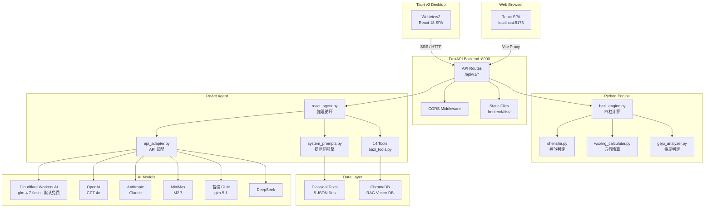
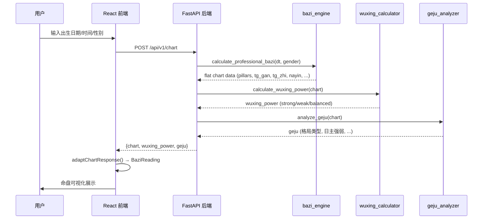
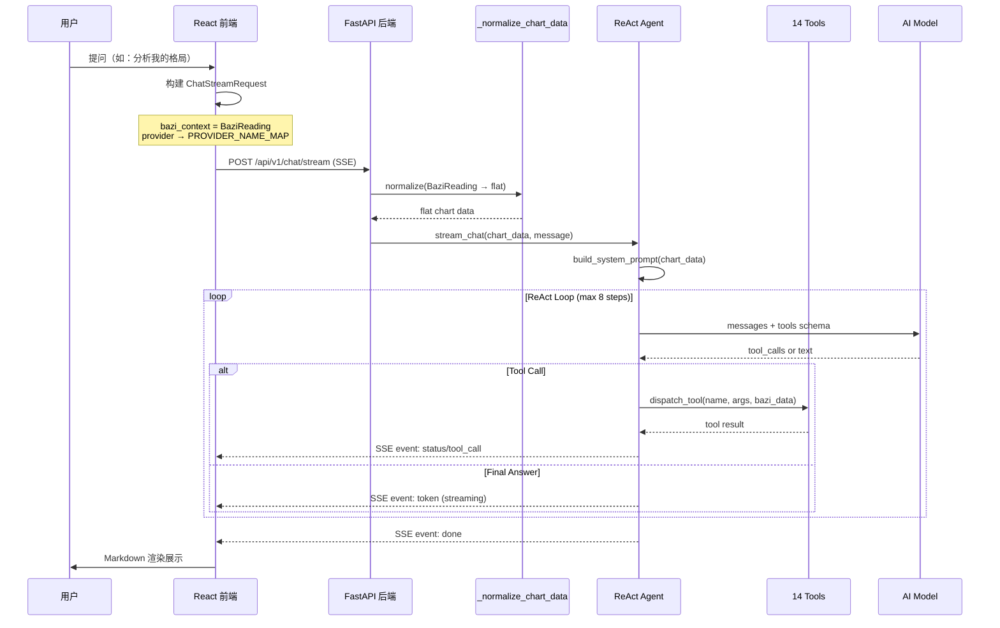
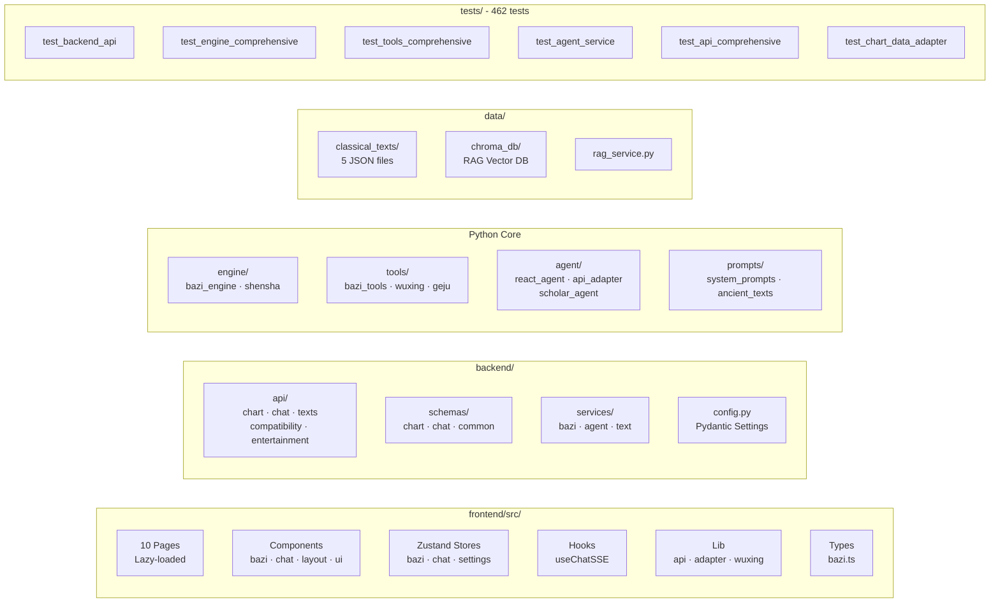
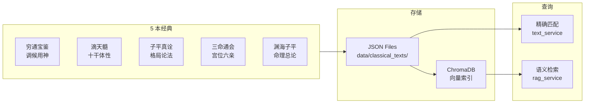

# FOR-BAZI · 玄冥 Cyber-Bazi

> 专业八字命理 AI 系统 — 排盘、五行精算、格局判定、大运流年、AI 对话解读

<p align="center">
  
  
  
  
  
  
  
</p>

<p align="center">
  <a href="#快速开始">快速开始</a> · <a href="docs/ARCHITECTURE.md">架构文档</a> · <a href="docs/API.md">API 文档</a> · <a href="docs/DEPLOYMENT.md">部署指南</a>
</p>

---

## 这个项目做了什么

八字排盘本身是**确定性计算**——四柱、藏干、纳音、神煞、大运，都由 `lunar-python` 加自研引擎算出，
不经过大模型，因此可复现、可测试（462 个用例覆盖）。大模型只负责**在算好的命盘上做解读**，
并且被约束成 ReAct 循环：它想引用流年干支、大运阶段、古籍原文，必须调用对应工具去取，
不能凭印象编。`fact_check_ganzhi` 会在收尾时反查干支是否被说错。

换句话说：**算的部分不让 AI 碰，说的部分不让 AI 编。**

AI 服务商默认走 **Cloudflare Workers AI 免费额度**（服务端配置，用户无需自备 Key），
同时保留自配置通道——OpenAI / Anthropic / 阿里云百炼 / DeepSeek / MiMo / 任意 OpenAI 兼容端点。

---

## 系统架构



## 核心数据流

### 排盘计算流程



### AI 对话流程



## 项目结构



<details>
<summary>完整目录树</summary>

```
FOR-BAZI/
├── engine/                    # 核心命理引擎
│   ├── bazi_engine.py         # 四柱八字计算（基于 lunar-python）
│   └── shensha.py             # 神煞判定（20+ 神煞）
│
├── tools/                     # 分析工具（14 个 Agent 工具）
│   ├── bazi_tools.py          # Agent 可调用工具集
│   ├── wuxing_calculator.py   # 五行力量精算
│   └── geju_analyzer.py       # 格局判定
│
├── agent/                     # AI Agent 层
│   ├── react_agent.py         # ReAct 推理循环
│   ├── api_adapter.py         # OpenAI/Anthropic API 适配
│   ├── scholar_agent.py       # RAG 学术 Agent
│   └── context_manager.py     # 上下文管理
│
├── prompts/                   # 提示词模板
│   ├── system_prompts.py      # 系统提示词（玄冥人设）
│   └── ancient_texts.py       # 古籍文献数据库
│
├── backend/                   # FastAPI 后端
│   ├── main.py                # 应用入口
│   ├── config.py              # Pydantic Settings
│   ├── api/                   # 5 个路由模块
│   ├── schemas/               # Pydantic 数据模型
│   └── services/              # 业务逻辑层
│
├── frontend/                  # React + Tauri 前端
│   ├── src/
│   │   ├── pages/             # 10 个页面（Lazy-loaded）
│   │   ├── components/        # bazi · chat · layout · ui
│   │   ├── stores/            # Zustand 状态管理（3 个）
│   │   ├── hooks/             # useChatSSE
│   │   ├── lib/               # api · response-adapter · wuxing
│   │   └── types/             # TypeScript 类型
│   └── src-tauri/             # Tauri v2 配置
│
├── data/                      # 数据层
│   ├── classical_texts/       # 5 本古籍 JSON
│   └── chroma_db/             # RAG 向量数据库
│
├── tests/                     # 462 个单元测试
├── mcp_server/                # MCP 工具服务器
├── docs/                      # 文档
└── streamlit_app.py           # Streamlit 旧版
```

</details>

## 功能模块

### AI 工具链 — 14 个专业命理工具

```mermaid
graph TD
    subgraph Agent["ReAct Agent 玄冥"]
        Router["dispatch_tool()"]
    end

    subgraph CoreTools["核心计算"]
        T1["get_annual_fortune<br/>流年干支"]
        T2["get_dayun_stage<br/>大运阶段"]
        T3["calculate_wuxing_power<br/>五行精算"]
        T4["analyze_wuxing_balance<br/>五行平衡"]
        T5["analyze_geju<br/>格局判定"]
    end

    subgraph ClassicalTools["古籍查询"]
        T6["query_qiongtong_guidance<br/>穷通宝鉴"]
        T7["query_disitian_guidance<br/>滴天髓"]
        T8["query_ziping_guidance<br/>子平真诠"]
        T9["query_sanming_guidance<br/>三命通会"]
        T10["query_classical_text<br/>通用古籍检索"]
    end

    subgraph AuxTools["辅助工具"]
        T11["rag_retrieve<br/>RAG 语义检索"]
        T12["query_xing_chong_he_hai<br/>刑冲合害"]
        T13["explain_shensha<br/>神煞解释"]
        T14["fact_check_ganzhi<br/>干支校验"]
    end

    Router --> T1 & T2 & T3 & T4 & T5
    Router --> T6 & T7 & T8 & T9 & T10
    Router --> T11 & T12 & T13 & T14
```



### 古典文献知识库



---

## 快速开始

### 环境要求

| 依赖 | 版本 | 用途 |
|------|------|------|
| Python | 3.10+ | 后端 + 命理引擎 |
| Node.js | 18+ | 前端构建 |
| Rust | 1.70+ | Tauri 桌面应用（可选） |

### 1. 克隆 & 安装

```bash
git clone https://github.com/gaaiyun/FOR-BAZI.git
cd FOR-BAZI

# Python 依赖
pip install -r backend/requirements.txt

# 前端依赖
cd frontend && npm install && cd ..
```

### 2. 配置 `.env`

默认服务商是 Cloudflare Workers AI，用它的免费额度即可跑通全部功能：

```env
# ── 默认：Cloudflare Workers AI（免费额度）──
BAZI_CF_ACCOUNT_ID=your-account-id      # 控制台右侧栏，或 npx wrangler whoami
BAZI_CF_API_TOKEN=your-api-token        # 需含 Account → Workers AI → Read 权限
BAZI_CF_MODEL=@cf/zai-org/glm-4.7-flash
```

<details>
<summary>改用其他服务商（可选）</summary>

```env
BAZI_OPENAI_API_KEY=sk-...
BAZI_OPENAI_BASE_URL=https://api.openai.com/v1
BAZI_OPENAI_MODEL=gpt-4o

# Anthropic 协议的 base_url 不要带 /v1，SDK 会自己拼 /v1/messages
BAZI_ANTHROPIC_API_KEY=sk-ant-...
BAZI_ANTHROPIC_BASE_URL=https://api.anthropic.com
```

用户也可以在「设置」页直接填自己的 Key，前端配置优先于服务端 `.env`。

</details>

> **模型必须支持 function calling。** ReAct 循环每轮都会带上工具 schema，
> 不支持工具调用的模型会静默忽略它们，导致古籍检索、流年校验等工具从不被触发。
> 免费额度内可选：`@cf/zai-org/glm-4.7-flash`（中文原生，131K 上下文）、
> `@cf/qwen/qwen3-30b-a3b-fp8`、`@cf/meta/llama-3.3-70b-instruct-fp8-fast`。

### 3. 启动

```bash
# 后端
python -m uvicorn backend.main:app --reload --host 0.0.0.0 --port 8000

# 前端（新终端）
cd frontend && npm run dev
```

访问 http://localhost:5173 或 http://localhost:8000

### 4. 桌面 EXE（可选）

```bash
cd frontend && npx tauri build
# 产出：frontend/src-tauri/target/release/bundle/nsis/FOR-BAZI_2.0.0_x64-setup.exe
```

---

## API 接口

| 端点 | 方法 | 说明 |
|------|------|------|
| `/api/v1/chart` | POST | 八字排盘计算 |
| `/api/v1/chat/stream` | POST | AI 流式对话（SSE） |
| `/api/v1/compatibility` | POST | 合婚匹配 |
| `/api/v1/texts` | GET | 古籍检索 |
| `/api/v1/entertainment/daily-fortune` | GET | 每日运势 |
| `/health` | GET | 健康检查 |

完整 API 文档见 [docs/API.md](docs/API.md)

---

## 技术栈

| 层 | 技术 |
|---|---|
| **前端** | React 18 · TypeScript · Vite 6 · Tailwind CSS 4 · shadcn/ui · ECharts 5 · Zustand 5 |
| **后端** | FastAPI · uvicorn · sse-starlette · Pydantic 2 · lunar-python |
| **AI** | Cloudflare Workers AI（默认）· OpenAI SDK · Anthropic SDK · ReAct Agent · RAG (ChromaDB + sentence-transformers) |
| **桌面** | Tauri v2 · Rust · WebView2 |
| **测试** | pytest · 462 tests · 100% 核心模块覆盖 |

---

## 配色系统

| 五行 | 颜色 | Hex |
|------|------|-----|
| 金 (Metal) | 金黄 | `#d4af37` |
| 木 (Wood) | 翠绿 | `#50c878` |
| 水 (Water) | 深蓝 | `#1e90ff` |
| 火 (Fire) | 赤红 | `#e94560` |
| 土 (Earth) | 土黄 | `#c9a96e` |

---

## 许可证

MIT License
