# FOR-BAZI 架构文档

> 系统架构、模块职责、数据流详细说明

---

## 1. 总体架构

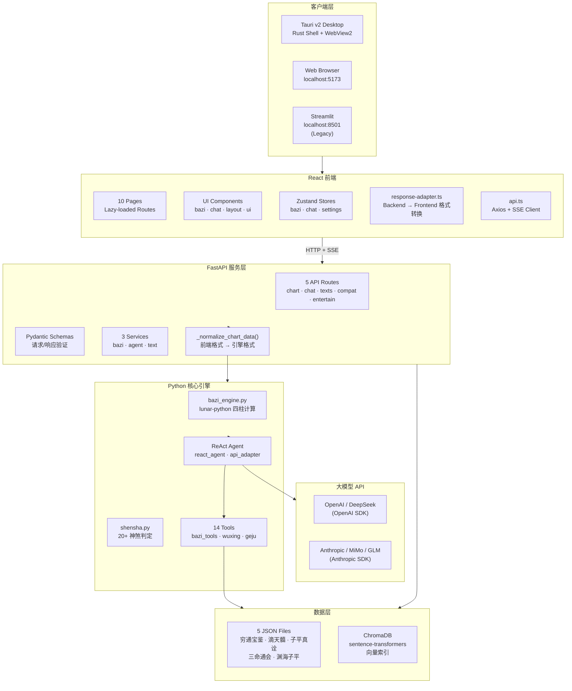

---

## 2. 前端架构

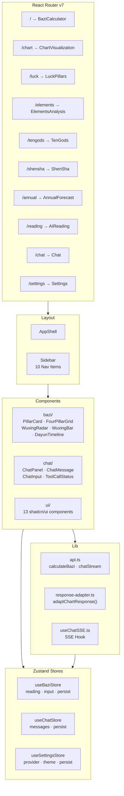

### 数据适配层

前端和后端使用不同的数据格式，`response-adapter.ts` 负责转换：

```mermaid
graph LR
    subgraph Backend["后端 Flat Format"]
        B_Pillars["pillars: ['壬午','丁未','庚寅','戊寅']"]
        B_TG["tg_gan: ['食神','正官','日主','偏印']"]
        B_TZ["tg_zhi: ['丁己','丁己乙','甲丙戊','甲壬']"]
        B_Nayin["nayin: ['杨柳木','天河水','松柏木','城头土']"]
        B_DM["day_master: '庚'"]
        B_MG["minggong: '甲寅'"]
    end

    subgraph Adapter["adaptChartResponse()"]
        Transform["格式转换<br/>flat arrays → nested objects<br/>camelCase 映射"]
    end

    subgraph Frontend["前端 BaziReading"]
        F_Chart["chart: {<br/>  year_pillar: {stem:'壬', branch:'午'},<br/>  day_master: '庚'<br/>}"]
        F_EB["element_balance: {金:1, 木:2, ...}"]
        F_TG["ten_gods: [{name,character,element}]"]
        F_DY["dayun: [{ganzhi, start_age, ...}]"]
        F_MG["ming_gong: '甲寅'"]
    end

    Backend --> Adapter --> Frontend
```

反向转换在 `agent_service._normalize_chart_data()` 中完成：

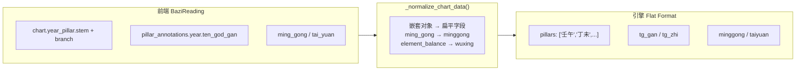

---

## 3. 后端架构

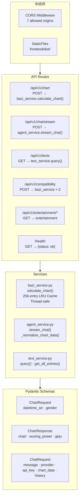

---

## 4. AI Agent 架构

### ReAct 推理循环

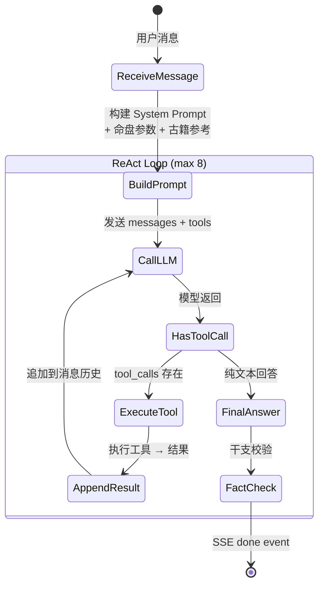

### API 适配层

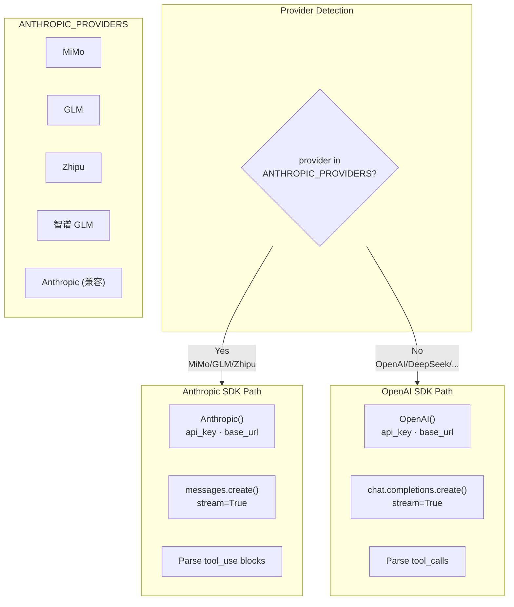

### 14 个工具注册表

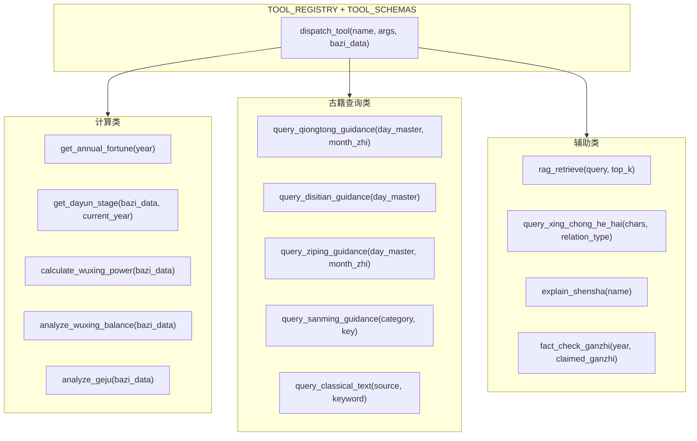

---

## 5. SSE 流式通信

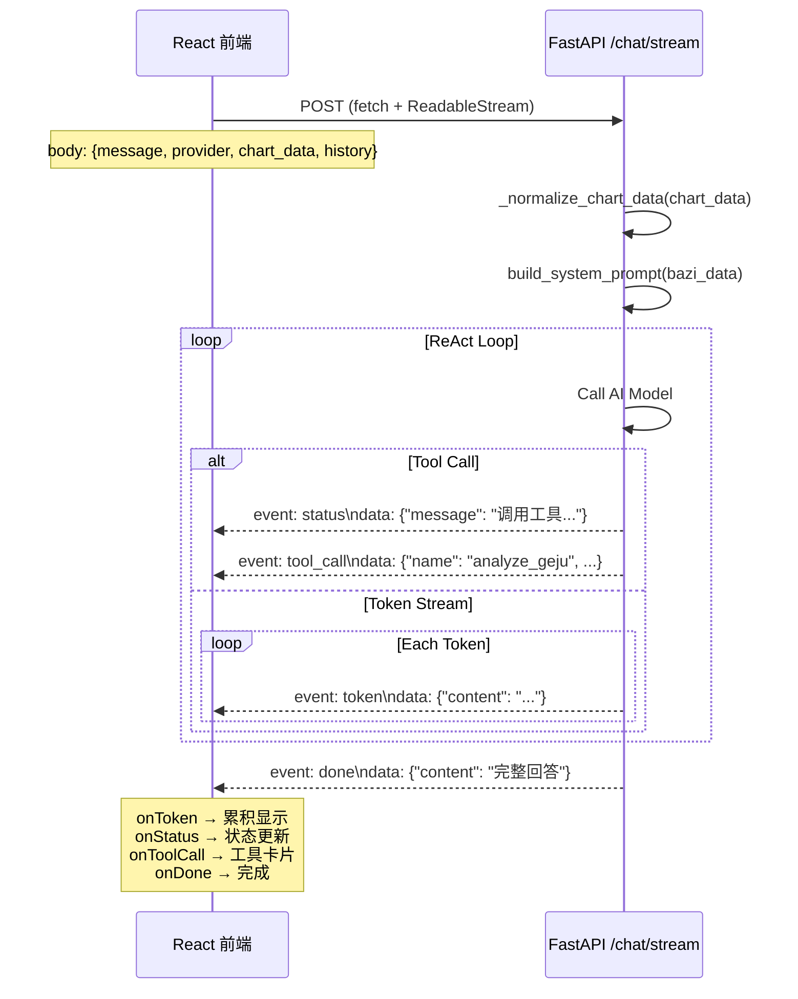

---

## 6. 数据模型

### 命盘数据流转

```mermaid
graph LR
    subgraph Input["用户输入 BaziInput"]
        I_DT["birth_date: '1985-06-15'"]
        I_TM["birth_time: '09:20'"]
        I_GD["gender: 'male'"]
    end

    subgraph Engine["引擎输出 (Flat)"]
        E_P["pillars: str[4]"]
        E_TG["tg_gan: str[4]"]
        E_TZ["tg_zhi: str[4]"]
        E_N["nayin: str[4]"]
        E_DM["day_master: str"]
        E_GD["gender: '乾造 (Male)'"]
        E_MG["minggong: str"]
        E_TY["taiyuan: str"]
        E_SG["shengong: str"]
        E_TX["taixi: str"]
        E_DS["dishi: str[4]"]
        E_XK["xunkong: str[4]"]
        E_SS["shensha: str[]"]
        E_SD["shensha_detail: dict"]
        E_WX["wuxing: dict"]
        E_XC["xingchong: dict"]
        E_DY["dayun: list"]
    end

    subgraph Frontend["前端 BaziReading"]
        F_C["chart: {<br/>  year/month/day/hour_pillar: Pillar<br/>  day_master: str<br/>}"]
        F_EB["element_balance: dict"]
        F_TG["ten_gods: TenGod[]"]
        F_DY["dayun: DayunEntry[]"]
        F_AP["annual_pillars: AnnualPillar[]"]
        F_PA["pillar_annotations: dict"]
        F_WP["wuxing_power: WuxingPower"]
        F_GJ["geju: Geju"]
        F_MG["ming_gong: str"]
        F_TY["tai_yuan: str"]
        F_GD["gender: str"]
    end

    Input -->|"calculateBazi()"| Engine
    Engine -->|"adaptChartResponse()"| Frontend
```

### Pydantic Schemas

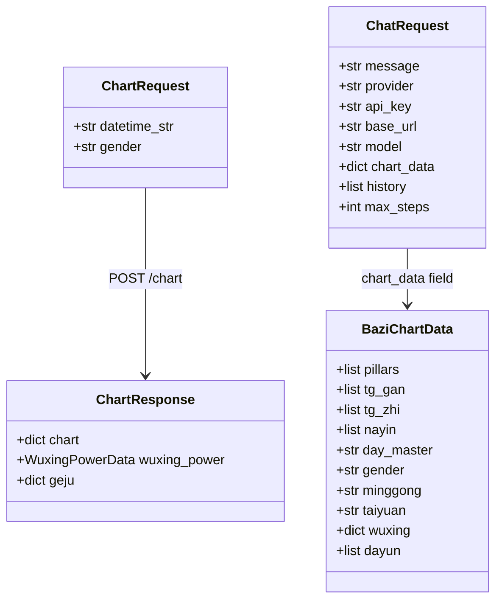

---

## 7. 测试架构

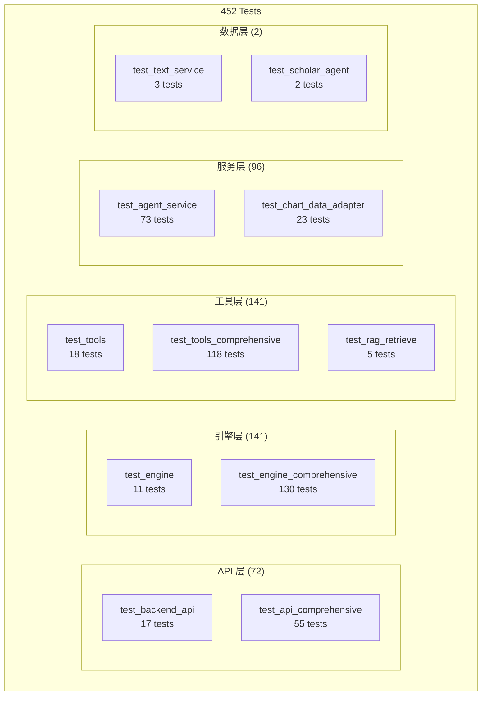

---

## 8. 部署模式

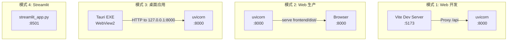

---

## 9. 配置系统

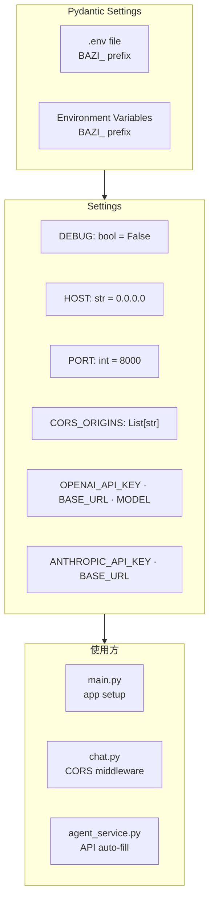
